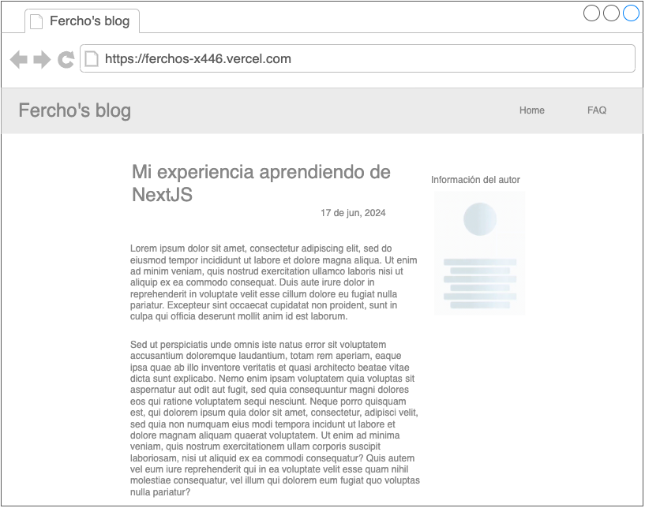

# Ejercicio práctico con NextJS y Sanity

## Objetivos
* Poner en práctica los conocimientos adquiridos acerca de NextJS en la implementación de ISR y SSR
* Aprender a diferenciar los tipos de datos en Sanity y a estructurar documentos
* Aprender a implementar texto enriquecido con Sanity
* Entender las buenas prácticas en el renderizado de imágenes con NextJS
* Aprender a utilizar algunos elementos importantes en la práctica de optimizaciones de SEO

## El reto

Cada uno va a implementar un blog personal. Este será un sitio donde cada uno pueda crear artículos personales sobre cualquier tema de su interés personal. A continuación describo como debe ser concebido este sitio:

### Layout del sitio
Debe contener un heading principal con el título de la página y unos links de navegación a 2 páginas del sitio: Home y FAQ. Este heading debe ser visible en todo momento en cualquier página que el usuario esté visitando.

El sitio tendrá 3 tipos de páginas:

### 1. Home
El Home deberá contener 2 secciones principales.

* En la parte superior, mostrar la lista completa de árticulos escritos, solo con su título y un corto texto del título, similar a como se muestran los resultados en Google.
* En la parte inferior, mostrar una sección de preguntas frecuentes

Tipo de renderizado: SSR

### 2. Artículo
En esta página se debe mostrar el contenido de un artículo escrito. Debe contener el título, la fecha y el texto escrito por el autor con posibilidad de renderizar el texto enriquecido, es decir, mantener cualquier formato aplicado en el editor de texto enriquecido en Sanity.

También, deberá mostrarse a la derecha la información del autor, mostrando su foto, nombre del autor y título del autor (El título del autor es abierto... puede decir "Ingeniero", "Co-Fundador", "Apasionado por el futbol"... cualquier tontería de título que quieran escribirse en la página del autor)

Esta página debe implementar `structured data` del tipo Article: https://developers.google.com/search/docs/appearance/structured-data/article

Además, el link de la página de artículo en aplicaciones como Teams, Facebook, Whatsapp, debe poder verse una previsualización de el título, la descripción y la imágen del artículo. (Hint: Open Graph)

Tipo de renderizado: ISR

### 3. FAQ

Esta página es para mostrar las preguntas frecuentes del usuario. Simplemente se muestran en lista junto con las respuestas escritas por el usuario.

Las preguntas frecuentes mostradas en esta página serán las mismas que se muestran en el Home en la parte inferior.

Esta pagina además debe implementar `structured data` del tipo FAQ: https://developers.google.com/search/docs/appearance/structured-data/faqpage

Tipo de renderizado: SSG

## Requerimientos técnicos:

* Para poder entregar la solución, esta debe estar publicada en la nube de `Vercel`, con el sitio en una dirección en internet. No se aceptan soluciones donde se muestre el resultado funcionando localmente en la máquina. "En mi máquina si funciona!" no es una entrega aceptable.
* Todas las páginas deben contener al menos título, meta descripción y meta keywords
* La solución debe estar escrita con Typescript
* No se requiere que la solución se vea bien desde el punto de vista de estilos. Simplemente utilizando los elementos nativos del navegador se debe poder lograr una apariencia aceptable del sitio, es decir, utilizando los elementos semanticos de HTML. Si se quieren aplicar estilos por alguna razón como disponer visualmente algunos elementos, se debe utilizar SCSS utilizando BEM para los estilos. No se admite el uso de frameworks de UI (Ni tailwind, ni bootstrap, ni material UI)
* Cada vez que ocurra un renderizado en el lado del servidor, enviar una notificación por webook a algún sitio de webhooks de demo enviando los siguientes datos:
- Fecha
- URL de la página
- Cantidad de llamados realizados a Sanity para ese renderizado.

> Se puede hacer uso de los sitios https://webhook.site, https://webhook-test.com/ o cualquier otro similar

* La información del Autor en Sanity debe ser reutilizable. Es decir que si yo creo un documento con la información de uno o más autores, a la hora de escribir cada artículo yo debería poder elegir uno ya existente o tener la posibilidad de crear uno nuevo.
* Para efectos del FAQ, este también debe venir de Sanity. Pueden pensar en crear un nuevo tipo de documento y asumir que el editor de contenido siempre mantendrá únicamente un documento de FAQ (A pesar de que el editor pueda crear varios documentos de este tipo)

## Solución de dudas:

* Yo Cristian Múnera, solo responderé preguntas respecto a la prueba con respuestas de SI y NO. También a preguntas respecto a la implementación técnica
* Se admite y se invita a que entre ustedes mismos se resuelvan inquietudes, sobre todo acerca de la parte técnica
* Tienen un máximo de 3 preguntas de respuesta amplia en las cuales yo pueda responder en un lapso máximo de 15 minutos por cada una de ellas. Ambos deben estar de acuerdo para abrir estos espacios

## Tiempo máximo de entrega de la solución
Se reciben soluciones hasta el Jueves 20 de Junio 2024 a las 11:00 AM hora de Colombia

## Sistema de evaluación

Al vuelo estilo Hogwarts! Al momento de la evaluación darémos los puntos de modo random como hacía Dumbledore con Harry pero sin rosca, es decir, si dimos 50 puntos por algo, ese mismo puntaje lo evaluaremos con el otro.

Así mismo, los evaluadores de una solución seran el contrincante y también yo.

En caso de que estemos evaluando a Juan y Cristian diga que miremos como está por ejemplo el responsive del sitio, eso mismo será evaluado también en la solución de Cristian, independientemente de que ya lo hayamos evaluado.
